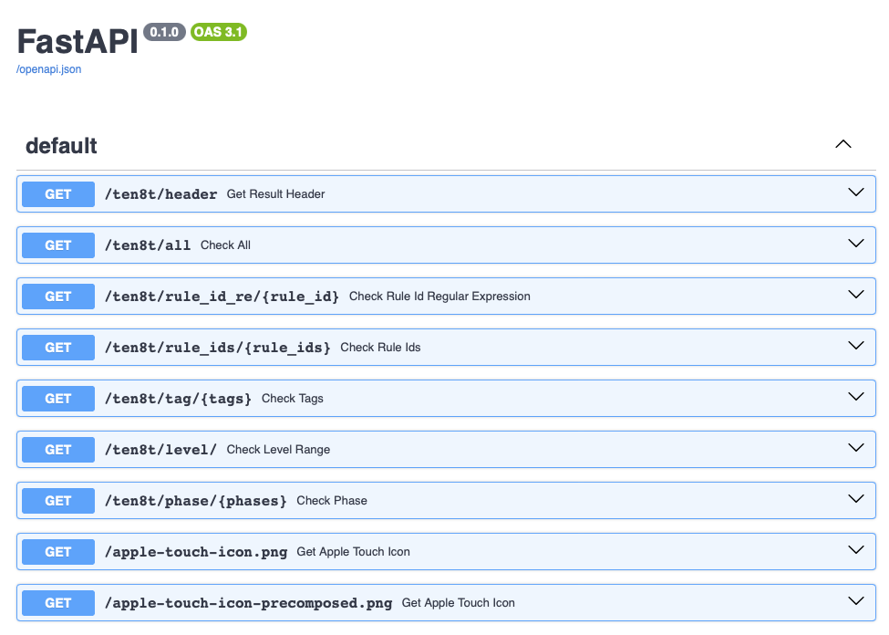
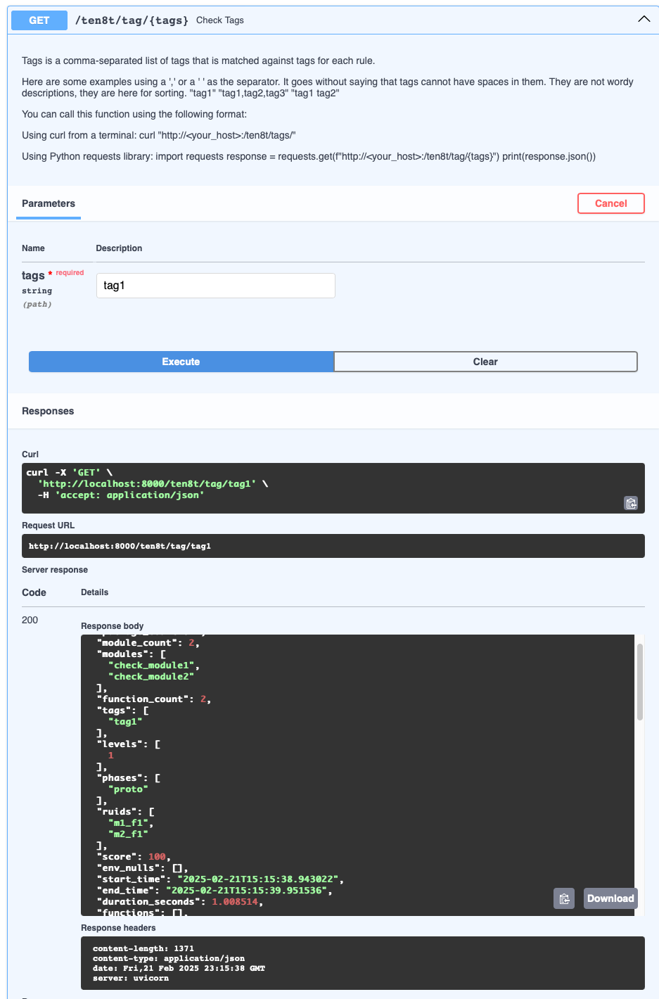
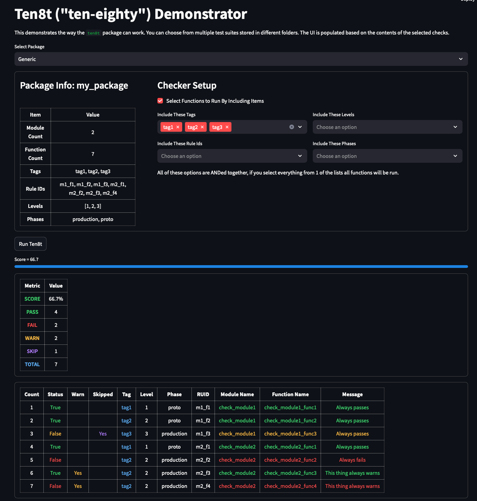
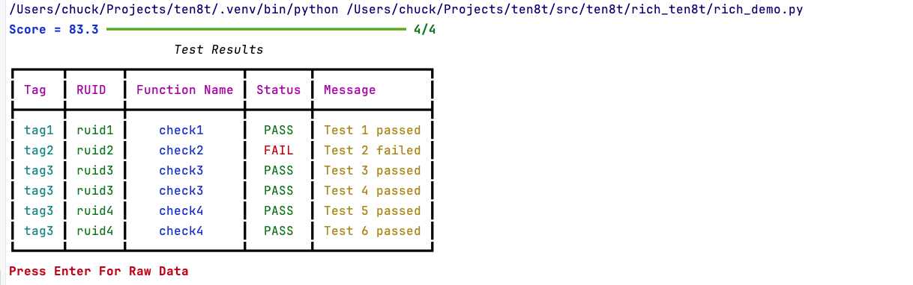
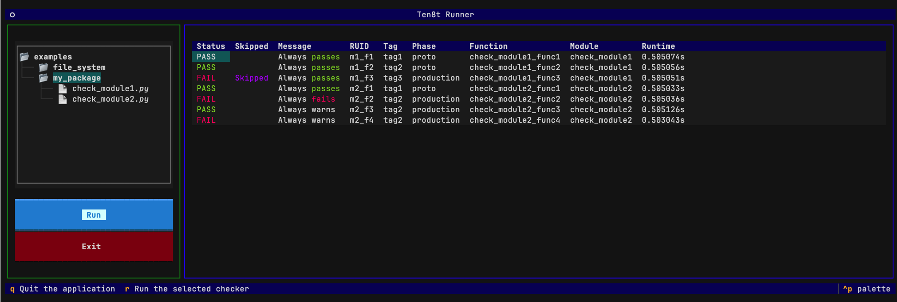
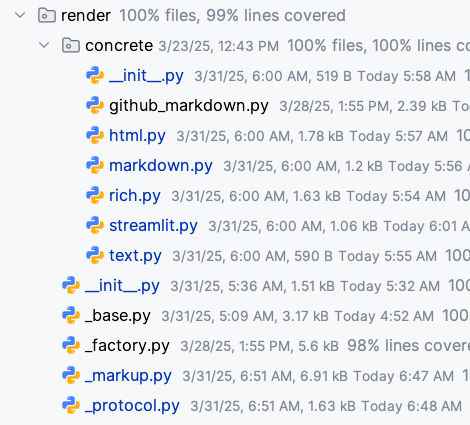

# Ten8t: Observability for Filesystems, APIs, Databases, Documents and more.

<!-- Pytest status is honor system based on running pytest/tox prior to push to GitHub -->

&nbsp;&nbsp;

&nbsp;&nbsp;
[](https://pypi.org/project/ten8t/)
&nbsp;&nbsp;
[](https://ten8t.readthedocs.io/en/latest/)
&nbsp;&nbsp;

<br>

&nbsp;&nbsp;

&nbsp;&nbsp;

&nbsp;&nbsp;


# Ten8t Framework

`Ten8t` (pronounced "ten-eighty") is a framework for observability and rule-based checks across files, folders, APIs,
spreadsheets, and projects. Inspired by `pytest` and `pylint`, it simplifies basic tasks while handling complex
scenarios flexibly. With reusable, declarative rules, Ten8t enables monitoring and validation of information
systems—from simple file existence checks to comprehensive system health verification.

Think of Ten8t as an infrastructure "lint builder" for file systems, databases, and documents. It enables quick
rule setup with Python data or JSON output for python/web integration. Examples with `streamlit`, `typer`, `rich`,
`FastAPI`, `uv run` and `textual` demonstrate low-friction development. While "standard" rules are available, writing
custom Python verifications is straightforward. `Ten8t` supports custom pass/fail checks organized with many attributes
for precise filtering control. Its design works for both small projects and complex systems, making basic
tests easy while remaining extensible through standard Python.

## Why Not pytest, Great Expectations or other popular tools?

The distinction between `Ten8t`, `pytest`, and Great Expectations and others lies in their scope, complexity, and
target audience.

### pytest:

- **Scope**: Focused on source code testing within the Python ecosystem.
- **Complexity**: Comprehensive and feature-rich, tailored for developers and integrated into IDEs.
- **Audience**: Consumed by developers, requiring a code-first approach.
- **Visibility**: Limited to `assert True, msg='...'` while most messages are meant to be hidden.

### Great Expectations (ge):

- **Scope**: Centered around data validation and expectation testing in data pipelines and notebooks.
- **Complexity**: Robust and feature-rich, catering to data scientists and integrated into data pipelines.
- **Audience**: Consumed by data scientists, emphasizing a data-first approach.
- **Visibility** Very good view of data integrity at the rule level.

### Tableaux/PowerBI

- **Scope** Centered around graphical output of charts, graphs, and status for corporate dash-boarding.
- **Complexity** Robust and feature rich catering to real time charting with complex graphical displays.
- **Audience** Consumed by everyone in an organization created as mostly in a low-code environment.
- **Visibility** Beautiful charting. For our application this is eye candy.

### Ten8t:

- **Scope**: Focused on testing filesystem, files, SQL, API access and custom coded python checks.
- **Complexity**: Designed for to be lightweight for developers to check things quickly and repeatably.
- **Audience**: This tool is a framework for infrastructure developers needing a tool to be the backbone of your
  observability. Since the output is directly available as JSON it is very easy to integrate.
- **Visibility**: `ten8t` generates JSON. Integration samples are included for `streamlit`, `FastAPI`, `textual` and
  `typer`.

## Getting Started with Ten8t

If you're familiar with `pytest`, getting started with `ten8t` is a breeze. If you're accustomed to writing tests
with modules starting with "test" and functions beginning with "test",
transitioning to `ten8t` will feel natural. Additionally, if you understand fixtures, you'll find that the concept is
also available through environments. Rule may be tagged with attributes to allow tight control over running checks.

### A modest checker...

The simplest thing you can do with `ten8t` takes a few functions, gives them to the checker
object and then tells that object to run all the functions, collect the results. This is the core.
Everything that follows from here is window dressing to make this test engine run.

```python
import ten8t as t8
import pathlib


def check_foo():
  """Check if a foo exists"""
  return pathlib.Path("./foo.txt").exists()


def check_fum():
  """Check if a fum exists"""
  return pathlib.Path("./fum.txt").exists()


# A checker object collections your functions up, runs them all and hands you back results.
results = t8.Ten8tChecker(check_f=[check_foo, check_fum]).run_all()


```

As you might expect, a framework could discover these tests provide 2 passing test results if the files all exist.

In order to be useful we need functions that return more detail and ideally functions that return more than
one `Ten8tResult`. So we support yield and a result object that stores...everything I could think of.

```python
from ten8t import TR, categories
import pathlib

#NOTE TR is an alias for Tent8tResult.  Since it is used very often it is useful to have a short version.

@categories(tag="foo")
def check_boolean():
    yield TR(status=pathlib.Path("./foo").exists(), msg="Folder foo exists")


@categories(tag="fum")
def check_yielded_values():
    yield TR(status=pathlib.Path("./fum").exists(), msg="Folder foo exists")
    yield TR(status=pathlib.Path("./fum").exists(), msg="Folder fum exists")
```

Running these will also provide 3 passing test results with richer data using the TR object. Note
that these functions yield results rather than return them and some tags have been added, foreshadowing that you
will be able to run the "foo" tests or the "fum" tests because the check function has be tagged with `categories`.

Now we can add more complexity running more complex code. Tag check functions with `categories` to allow
subsets of checks to be run. Below two functions are given different tags. When you make calls to run
checks you can specify which tags
you want to allow to run.

```python
from ten8t import categories, TR
import datetime as dt
import pathlib

@categories(tag="file_exist")
def check_file_exists():
    """ Verify this that my_file exists """
    status = pathlib.Path("my_file.csv").exists()
    yield TR(status=status, msg="Verify daily CSV file exists")

@categories(tag="file_age")
def check_file_age():
    file = pathlib.Path("my_file.csv")
    modification_time = file.stat().st_mtime
    current_time = dt.datetime.now().timestamp()
    file_age_in_seconds = current_time - modification_time
    file_age_in_hours = file_age_in_seconds / 3600
    if file_age_in_hours < 24:
        yield TR(status=True, msg="The file age is OK {file_age_in_hours}")
    else:
        yield TR(status=False, msg="The file is stale")
```

And even a bit more complexity pass values to these functions using environments, which are similar to `pytest`
fixtures. `Ten8t` detects functions that start with "env_" and calls them prior to running the check functions.
It builds an environment that can be used to pass parameters to check functions. Typically, things like database
connections, filenames, config files are passed around with this mechanism. Note that in multi threading checking
some variables may not be shared across threads. File names, lists of strings and integers (and anything hashable)
work fine, but sharing a SQL connection across threads won't work.

```python
import datetime as dt
import pathlib
from ten8t import categories, TR


def env_csv_file():
    env = {'csv_file': pathlib.Path("my_file.csv")}
    return env


@categories(tag="file")
def check_file_exists(csv_file):
    """ Verify this that my_file exists """
    return TR(status=csv_file.exists(), msg="Verify daily CSV file exists")


@categories(tag="file")
def check_file_age(csv_file):
    modification_time = csv_file.stat().st_mtime
    current_time = dt.datetime.now().timestamp()
    file_age_in_seconds = current_time - modification_time
    file_age_in_hours = file_age_in_seconds / 3600
    if file_age_in_hours < 24:
        return TR(status=True, msg="The file age is OK {file_age_in_hours}")
    else:
        return TR(status=False, msg="The file is stale")
```

## Threading Support

Threading is supported in various ways. The easiest way to enable threading is by setting
`thread_ids` using the `@threading` decorator and then using the `Ten8tThread` object to run the checker.
Under non-free-threading pythons, IO bound calls will scale nicely with the number of workers.
Keep in mind that you are still responsible for writing code that is threadable. Database connections
and dataframes and things aren't hashable will likely have issues. As a general rule if you keep all
of your check functions in a single file and all of those functions work with their own copy of data
and setup things will work nicely, if you give every function a unique thread id and try to run everything
concurrently you may have issues.

Test cases with things like ping or requests show very nice improvements.

```python
import datetime as dt
import pathlib
from ten8t import categories, threading, TR, Ten8tChecker, Ten8tThread


@categories(tag="file")
@threading(thread_id='thread1')
def check_file_exists():
    """ Verify this that my_file exists """
    return TR(status=pathlib.Path('my_file.txt').exists(), msg="Verify daily CSV file exists")


@categories(tag="file")
@threading(thread_id='thread2')
def check_file_age():
    modification_time = pathlib.Path('my_file.txt').stat().st_mtime
    current_time = dt.datetime.now().timestamp()
    file_age_in_seconds = current_time - modification_time
    file_age_in_hours = file_age_in_seconds / 3600
    if file_age_in_hours < 24:
        return TR(status=True, msg="The file age is OK {file_age_in_hours}")
    else:
        return TR(status=False, msg="The file is stale")


ch = Ten8tChecker(check_functions=[check_file_age, check_file_exists])

# Use the Ten8tThread class to run the checker.  
results = Ten8tThread(checker=ch).run_all(max_workers=5)

```

## How is `Ten8t` Actually Used?

Once you have your check functions written you need to set up a `Ten8tChecker` object to run them. All the
preceding examples have the list of functions passed to the Checker class. In real projects the best way to
handle setting up check functions is to use modules or packages.

A common use case is to have check-functions saved in python source files that `ten8t` can discover via
the import mechanism allowing auto-detection of check-functions like `pytest`.

This might look like:

#### `check_rules.py`

```python
import ten8t as t8


def rule1(cfg):
    return 1 in cfg['data']


def rule2(cfg):
    return 2 in cfg['data']


def rule3(cfg):
    return 3 in cfg['data']


def rule4(cfg):
    return 4 in cfg['data']
```

```python
import ten8t as t8

checker = t8.Ten8tChecker(module='check_rule.py', env={'data': [1, 2, 3, 4]})
results = checker.run_all()
```

Ten8t uses the following hierarchy:

    Ten8tPackage` (one or more Ten8tModules in a folder)
        Ten8tModule` (one or more Ten8tFunctions in a Python file (function starting with the text "check_"))
            Ten8tFunction` (when called will return 0 or more `Ten8tResults`)

Typically one works at the module or package level where you have python files that have 1 or more functions in them,
and you have collections of python files (modules) to make packages. Note that `ten8t` a module is 1 file and a
package is a folder with at least one file that has a check function. In real use cases this is almost always how
`ten8t` is used. Auto discovery simplifies things.

Each `Ten8tFunction` returns/yields 0-to-N results from its generator function. By convention, if None is returned, the
rule was skipped.

The rule functions that you write don't need to use generators. They can return a variety of output
(e.g., Boolean, List of Boolean, `Ten8tResult`, List of `Ten8tResult`), or you can write a generator that yields
results as they are checked. Canonical form is that you yield, but `ten8t` is tolerant.

Alternatively you can ignore the file and folder discovery mechanism and provide a list of rules as regular python
functions and `Ten8t` will happily run them for you from a list of check functions passed at `Ten8tChecker` object
creation time.

```python
import ten8t as t8


def rule1(cfg):
   return 1 in cfg['data']


def rule2(cfg):
   return 2 in cfg['data']


def rule3(cfg):
   return 3 in cfg['data']


def rule4(cfg):
   return 4 in cfg['data']


checker = t8.Ten8tChecker(check_functions=[rule1, rule2, rule3, rule4], env={'data': [1, 2, 3, 4]})
results = checker.run_all()
```

You can see here that data is provided externally, but programmatically via the env parameter. Often times
this parameter is directly loaded from a config file, or comes pre-populated with data frames and database
connections.

## Rule Integrations

To simplify getting started, there are included rules you can call to check files and folders on your file system
dataframes, Excel spreadsheets, PDF files and web APIs. These integrations make many common checks just a
few lines of code.

These generally take the form of you wrapping them up with data specific to your system.

The rules shown below trigger errors if there are any log files > 100k in length and if they haven't been updated
in the last 5 minutes using rules from based on the `pathlib` packages

<!--file ../src/ten8t/uv_ten8t/uv_rule_clip.py-->
```python
#!/user/bin/env -S uv run --script
# /// script
# dependencies = ["ten8t>=0.0.22"]
# ///

import pathlib

import ten8t as t8
from ten8t import Ten8tBasicMarkdownRenderer, Ten8tChecker, cwd_here

cwd_here(__file__)


@t8.categories(tag="file")
def check_rule1():
    root = pathlib.Path('../examples/file_system')
    for folder in [root / f for f in ['folder1', 'folder2', 'folder3']]:
        yield from t8.rule_large_files(folders=folder, pattern="*.txt", max_size=100_000)


@t8.categories(tag="tag")
def check_rule2(cfg):  # <-- Config file has the test setup
    """cfg: application config file."""
    for folder in cfg['logging']['folders']:
        yield from t8.rule_stale_files(folders=folder, pattern="*.txt", minutes=5.0)


cfg = {'cfg': {'logging': {'folders': ["../examples/file_system/folder1"]}}}

ch: Ten8tChecker = t8.Ten8tChecker(check_functions=[check_rule1, check_rule2],
                                   env=cfg,
                                   renderer=Ten8tBasicMarkdownRenderer())

for r in ch.yield_all():
    print(ch.result_strategy.render(r))
print(ch.status_strategy.render(ch))

```

<small>uv_rule_clip.py &nbsp;&nbsp; 05:41:36 2025-04-03</small>

<!--file end-->

Running this file yields markdown of:
<small>
<!--file ../src/ten8t/uv_ten8t/uv_rule_clip.md-->

Status:PASS Skip:False Msg:**NO** files found matching `*.txt` in `examples/file_system/folder1`. <br>
Status:PASS Skip:False Msg:**NO** files found matching `*.txt` in `examples/file_system/folder2`. <br>
Status:PASS Skip:False Msg:**NO** files found matching `*.txt` in `examples/file_system/folder3`. <br>
Status:FAIL Skip:False Msg:Stale file `../examples/file_system/folder1/file2.txt`
`age = 54949.40 minutes age_in_seconds=300.0` <br>
Status:FAIL Skip:False Msg:Stale file `../examples/file_system/folder1/file1.txt`
`age = 54949.40 minutes age_in_seconds=300.0` <br>
3 Pass/2 Fail of **5** Total ten8t:0.0.21 runtime=0.001 sec <br>


<small>uv_rule_clip.md &nbsp;&nbsp; 13:42:10 2025-04-02</small>

<!--file end-->

## Integration,Rendering and Serializing

Ease of integration with external tools and workflows is a key design goal for `Ten8t`. While providing useful
functionality is valuable, seamless integration significantly enhances utility. There are multiple
options provided by `Ten8t` shown in the table below.

| Integration Method      | Explanation                                                                                   | Examples & Supported Formats                                      |
|-------------------------|-----------------------------------------------------------------------------------------------|-------------------------------------------------------------------|
| **Direct Class Access** | Direct invocation of Ten8t internal classes and APIs within your Python codebase.             | Custom Python scripts or workflows                                |
| **JSON Export**         | Export results into standard JSON format for easy consumption by external services or APIs.   | FastAPI, REST services                                            |
| **Rendered Outputs**    | Render and stream Ten8t's outputs directly into visualization and UI-oriented frameworks/tools.| `rich`, `streamlit`, `textual`, `markdown`, `text`, `html`       |
| **Direct Serialization**| Serialize data directly into widely-used file formats for offline review or sharing.          | `markdown`, `csv`, `excel`                                        |

## FastAPI Interface Demo (`ten8t/cli`)

To integrate your rule checking results with a web API using `FastAPI`, you can refer to the `ten8t_cli.py` file for a
straightforward approach to creating a `FastAPI` app from your existing code. No changes are required in your code to
support a `FastAPI` interface. If you have created `rule_id`s for all of your rule functions, they will all be
accessible via the API. Alternatively, if you haven't used `rule_id`s, you can run the entire set of
functions or filter by `tag`, `level` or `phase`. The sample command-line app serves as a simple example
of how to connect a `ten8t` ruleset to the web via FastAPI.

Integration with `FastAPI` is simple since it utilizes Python dicts for result data.
The `ten8t_cli` demo tool demonstrates that this can be achieved with just a few lines of code to
create a FastAPI interface.

Simply run the command with the `--api` flag, and you'll see `uvicorn` startup your API. Go to
http://localhost:8000/docs to see the API.

```
/Users/chuck/ten8t/.venv/bin/python ten8t_cli.py --pkg . --api 
INFO:     Started server process [3091]
INFO:     Waiting for application startup.
INFO:     Application startup complete.
INFO:     Uvicorn running on http://0.0.0.0:8000 (Press CTRL+C to quit)
INFO:     127.0.0.1:64116 - "GET / HTTP/1.1" 404 Not Found
INFO:     127.0.0.1:64116 - "GET /docs HTTP/1.1" 200 OK
INFO:     127.0.0.1:64116 - "GET /openapi.json HTTP/1.1" 200 OK
```

And going to `localhost:8000/docs` gets you this:

FastAPI swagger interface:



FastAPI example running some rules:



## Streamlit Demo  (`ten8t/st_ten8t`)

Integration with `streamlit` was important, so the way you interact with `ten8t` works well with the
tools that `streamlit` exposes. Here is a non-trivial
example showing many of the features of `ten8t` in a `streamlit` app. In 200 lines of code you can select from
packages folders, have a full streamlit UI to select the package, tags,levels, ruids and generate colored
tabular report.

From the sitepackages/lib/ten8t/st_ten8t folder run the command

`st_ten8t % python -m streamlit run st_demo.py`



## Rich Demo (`ten8t/rich_ten8t`)

Here is an example of connecting `ten8t` up to the `rich` package using the progress bar object to
move a progress bar, and the `rich` table and some emojis to make a tabular output.

It is worth noting here that there are 4 progress bar steps, but there are 6 results. Is this a bug?
No. It is not possible to reliably count the number of checks that will be performed before running
the checker. This is because check functions can yield many results. What we can count is the number
of functions that have been registered, so progress is given in functions run not yielded results.



## Textual Demo (`ten8t/textual_ten8t`)

The folder `textual_ten8t` has a demonstration app showing `ten8t` integration with `textual` by supporting
the same `examples` folder used in other demos. This demo shows how logging, checking, and basic interactions with
`ten8t` are performed. Because `ten8t` supports `rich` formatting the messages generated by checking functions are
displayed as formatted text.

If you know `Textual` this demo should get you well on your way.

The `--folder`/`-f` option allows you to pass in a root folder for the textual file system viewer. This
capability allows you to use the demo app as a development tool since it gives a flexible way to look at
packages and modules and run them independently. The default is the current working directory. While this is
just a demo, it is quite useful in that you can rapidly test your rule sets interactively.



## `uv` run Example (`uv_ten8t`)

It wouldn't be an example unless we showed you that you can run this with `uv` without knowing anything beyond
installing `uv` on your machine by taking advantage of support for [PEP 723](https://peps.python.org/pep-0723/). Note
the use of the `cwd_here` function. This is a utility function in `ten8t` that makes the current working
directly the current file. This is very useful for examples that are included with the baseline installation.
This allows you to type

`python lib/site-packages/ten8t/uv_ten8t/uv_ten8t.py`

and not worry about what folder you ran from.

<!--file ../src/ten8t/uv_ten8t/uv_ten8t.py-->
```python
#!/user/bin/env -S uv run --script
# /// script
# dependencies = ["ten8t>=0.0.22"]
# ///

"""Example of a checker run under uv run"""

import ten8t as t8
from ten8t import Ten8tChecker, Ten8tResult, cwd_here

cwd_here(__file__)

def check_1():
    """ Always returns pass """
    return t8.Ten8tResult(status=True, msg="This test worked.")  # pragma no cover


def check_2():
    """ List of filenames """
    yield from t8.rule_paths_exist(paths=["uv_ten8t.py"])


def check_3():
    """ String of file names """
    yield from t8.rule_paths_exist(paths="uv_ten8t.py")


def check_4():
    """ Multiple paths in string """
    yield from t8.rule_paths_exist(paths="uv_ten8t.py .")


def check_5():
    """ Check multiple URLs """
    yield from t8.rule_url_200(urls="http://www.google.com http://www.microsoft.com")


ch = Ten8tChecker(check_functions=[check_1, check_2, check_3, check_4, check_5])
result: Ten8tResult = None

for result in ch.yield_all():
    if result.status:
        print(f"Pass: Function:{result.func_name} - {result.msg_rendered}")
    else:
        print(f"Fail: Function:{result.func_name} - {result.msg_rendered}")

print(f"Final result: {ch.pass_count=} {ch.fail_count=} ")

```

<small>uv_ten8t.py &nbsp;&nbsp; 05:47:36 2025-04-03</small>

<!--file end-->

__Then type in `uv run uv_ten8t.py` and see the magic of `uv` make it just work.__

```text
(ten8t) chuck@Chucks-Mac-mini uv_ten8t % uv run uv_ten8t.py
Pass: Function:check_1 - This test worked.
Pass: Function:check_2 - The path uv_ten8t.py does exist.
Pass: Function:check_3 - The path uv_ten8t.py does exist.
Pass: Function:check_4 - The path uv_ten8t.py does exist.
Pass: Function:check_4 - The path . does exist.
Pass: Function:check_5 - URL https://www.google.com returned 200
Pass: Function:check_5 - URL https://www.microsoft.com returned 200

```

NOTE: At this time, the installation of `ten8t` still has development and optional dependencies installed, that is why
there are so many. The dependency list will be MUCH smaller soon.

## TOX

`Ten8t` is tested under Python 3.10, 3.11, 3.12 and 3.13.

```text
2025-03-17 14:48:54 [INFO] pytest_logger: Global pytest logger initialized.
.pkg: _exit> python /Users/chuck/Projects/ten8t/.venv/lib/python3.13/site-packages/pyproject_api/_backend.py True poetry.core.masonry.api
  py313: OK (16.88=setup[5.55]+cmd[11.33] seconds)
  py310: OK (16.59=setup[3.94]+cmd[12.65] seconds)
  py311: OK (14.60=setup[3.04]+cmd[11.56] seconds)
  py312: OK (17.77=setup[4.81]+cmd[12.95] seconds)
  lint: OK (14.19=setup[2.91]+cmd[11.29] seconds)
  congratulations :) (80.06 seconds)
```

## Lint

```text
------------------------------------------------------------------
Your code has been rated at 9.79/10 (previous run: 9.79/10, +0.00)
```

# Development Comments

This project serves as both a practical tool and a playground for advanced Python features I don't
encounter often in my day job: code inspection, advanced yielding, threading, strategy patterns, dynamic
function creation, hooks, decorators, mypy, GitHub, pypi, tox, pytest integration, coverage metrics,
dynamically created readme and readthedocs integration.

As it evolved, tests have proven invaluable. They give me confidence
to perform major architectural changes, confirming everything works when tests pass. TDD increases time
because you need to make the tests, but it reduces debug time and dramatically reduces refactoring time
as well as increasing the confidence in the code as you make changes...and if you miss something add the
tests that would have caught it. A significant amount of testing can be thought of as automated debugging,
sure it took a little more time upfront to write a test, but every time after that I'm not in the debugger
stepping and that payback is huge...and then couple that with testing on different versions and manual
testing becomes intractable.

TDD complements YAGNI principles in my development approach. Rather than creating extensive object
systems upfront, classes were built incrementally, only refactoring when the existing abstraction no
longer supports clean design. This contrasts with my early career tendency to build elaborate webs
of interacting objects most of which would never be derived from and often times needed extensive
coupling.

## Philosophy

The general "API" to `ten8t` prioritizes flexibility and dev. experience. Rather than requiring strict
parameter formats, the library "intelligently" handles various input types to save users time and
reduces friction.

The API often times accepts data in multiple types:

1) Lists of strings can be passed as space-delimited strings (`"foo fum quux"`), single values (`"foo"`),
   conventional lists (`["foo"]`), or even empty values (`""`, `[]`, `None`)
2) File paths work with both strings (`"file.txt"`) and `pathlib.Path` objects (`pathlib.Path("file.txt")`)
3) When a list is expected but a single item is provided, the API automatically wraps it in a list
4) When you pass a list of functions to the checker they can be regular python functions, or they can be
   of type `Ten8tFunction`...`ten8t` will generically wrap the function with no special attributes.

This approach simplifies integration with configuration files and command-line options by reducing data
transformation code. While this diverges from strict typing practices, it improves developer
experience and speeds up implementation.

### Class Hierarchy

For the most part any structures that have base class/subclass hierarchy are split out into the
structure that looks like a folder with a bunch of private classes that define the abstract class
and any supporting classes, and then a concrete folder that has private classes that define this
functionality exposed to the application.



In this example you can see there is a `_base.py`, `_factory.py`, `_protocol.py` and `_markup.py`
classes that implement the base features of the object and then there are derived classes to support
each of the rendering transformation for the target output.

The public interface is described in the `__init__.py` file so you never need to know about how
the classes are structured allowing for you to just say `import .render` and you can be confident that
you have everything you need. At this time rendering, rc files, logging, scoring and serialization have
such interfaces.

```python
"""
Exports all `Ten8t` renderer classes from the render package.
"""

# Import base classes and protocols
from ._base import Ten8tAbstractRenderer

# Import factory
from ._factory import Ten8tRendererFactory

# Import markup definitions
from ._markup import TAG_ACTUAL, TAG_BLACK, TAG_BLUE, TAG_BOLD, TAG_CODE, TAG_DATA, TAG_EXPECTED, TAG_FAIL, TAG_GREEN,
    TAG_ITALIC, TAG_ORANGE, TAG_PASS, TAG_PURPLE, TAG_RED, TAG_SKIP, TAG_STRIKETHROUGH, TAG_UNDERLINE, TAG_WARN,
    TAG_WHITE, TAG_YELLOW, Ten8tMarkup
from ._markup import TM, Ten8tMarkup
from ._protocol import Ten8tRendererProtocol

# Import concrete renderers
from ._concrete import (Ten8tBasicHTMLRenderer, Ten8tBasicMarkdownRenderer, Ten8tBasicRichRenderer,
                       Ten8tBasicStreamlitRenderer, Ten8tGitHubMarkdownRenderer, Ten8tTextRenderer)

# Define the public exports
__all__ = [
    # Base classes
    'Ten8tAbstractRenderer',
    'Ten8tRendererProtocol',

    # Renderers
    'Ten8tBasicHTMLRenderer',
    'Ten8tBasicMarkdownRenderer',
    'Ten8tGitHubMarkdownRenderer',
    'Ten8tBasicRichRenderer',
    'Ten8tBasicStreamlitRenderer',
    'Ten8tTextRenderer',
    'Ten8tRendererFactory',

    # Markup
    'Ten8tMarkup',
    'TM',

    # Tags
    'TAG_BOLD', 'TAG_ITALIC', 'TAG_UNDERLINE', 'TAG_STRIKETHROUGH',
    'TAG_DATA', 'TAG_EXPECTED', 'TAG_ACTUAL', 'TAG_FAIL', 'TAG_PASS',
    'TAG_CODE', 'TAG_RED', 'TAG_BLUE', 'TAG_GREEN', 'TAG_PURPLE',
    'TAG_ORANGE', 'TAG_YELLOW', 'TAG_BLACK', 'TAG_WHITE', 'TAG_WARN', 'TAG_SKIP'
]
```

## Code Metrics (from `radon`)

Code quality is tracked using [Radon](https://github.com/rubik/radon) metrics across the `ten8t` package.
In general, the codebase maintains good quality scores with mostly A's and B's.

The columns below have been sorted worst to best. It can be seen that most of the complexity is in the
`ten8t_checker`/`function`/`yield` modules as those are the most complex functionality in the system, and
they are reliably at the top of all of these metrics. This is where the pain is and where effort should
be placed on improving the code.

Pull requests addressing code quality in lower-scoring files are welcome...actually any PRs are welcome.

NOTE: Restructuring occurred recently made the flat architecture more hierarchical, where classes that were
subclassed were made into subprojects and files were split up in to folders and sub folders
(see folders progress/rc/render/score/serialize) At this time those files are not visible in this listing.

__Halstead__
<!--file snippets/radon_hal.csv-->

| File               | Bugs | Difficulty | Effort  | Time   | Bugs<br>Rank | Difficulty<br>Rank | Effort<br>Rank | Time<br>Rank |
|--------------------|------|------------|---------|--------|--------------|--------------------|----------------|--------------|
| ten8t_checker.py   | 0.49 | 6.64       | 9704.10 | 539.12 | F            | A                  | D              | F            |
| ten8t_function.py  | 0.18 | 6.68       | 3660.46 | 203.36 | C            | A                  | C              | D            |
| ten8t_yield.py     | 0.17 | 4.67       | 2420.79 | 134.49 | C            | A                  | C              | C            |
| ten8t_util.py      | 0.10 | 3.75       | 1180.78 | 65.60  | C            | A                  | B              | B            |
| ten8t_attribute.py | 0.08 | 6.00       | 1483.05 | 82.39  | B            | A                  | B              | B            |
| ten8t_module.py    | 0.06 | 5.36       | 1025.19 | 56.95  | B            | A                  | B              | B            |
| ten8t_ruid.py      | 0.03 | 3.75       | 378.84  | 21.05  | A            | A                  | A              | A            |
| ten8t_result.py    | 0.03 | 2.71       | 232.47  | 12.92  | A            | A                  | A              | A            |
| ten8t_filter.py    | 0.03 | 2.00       | 159.45  | 8.86   | A            | A                  | A              | A            |
| ten8t_package.py   | 0.03 | 1.64       | 124.60  | 6.92   | A            | A                  | A              | A            |
| ten8t_thread.py    | 0.01 | 1.00       | 15.51   | 0.86   | A            | A                  | A              | A            |
| ten8t_logging.py   | 0.00 | 0.50       | 1.00    | 0.06   | A            | A                  | A              | A            |
| ten8t_exception.py | 0.00 | 0.00       | 0.00    | 0.00   | A            | A                  | A              | A            |
| ten8t_immutable.py | 0.00 | 0.00       | 0.00    | 0.00   | A            | A                  | A              | A            |

<small>radon_hal.csv &nbsp;&nbsp; 06:12:42 2025-04-03</small>

<!--file end-->

__Maintainability Index__
<!--file snippets/radon_mi.csv-->

| File               | Maint.<br>Index | Rank |
|--------------------|-----------------|------|
| ten8t_checker.py   | 24.40           | A    |
| ten8t_yield.py     | 47.50           | A    |
| ten8t_function.py  | 51.80           | A    |
| ten8t_attribute.py | 58.30           | A    |
| ten8t_result.py    | 61.70           | A    |
| ten8t_util.py      | 61.90           | A    |
| ten8t_module.py    | 62.80           | A    |
| ten8t_thread.py    | 63.90           | A    |
| ten8t_filter.py    | 68.20           | A    |
| ten8t_package.py   | 71.70           | A    |
| ten8t_ruid.py      | 78.20           | A    |
| ten8t_logging.py   | 89.50           | A    |
| ten8t_exception.py | 100.00          | A    |
| ten8t_immutable.py | 100.00          | A    |

<small>radon_mi.csv &nbsp;&nbsp; 06:12:42 2025-04-03</small>

<!--file end-->

__Complexity__
NOTE: This is by class. There is some function based code that is invisible (e.g., decorators in `ten8t_attribute.py`).
<!--file snippets/radon_cc.csv-->

| File               | Name                  | Rank | Complexity |
|--------------------|-----------------------|------|------------|
| ten8t_function.py  | Ten8tFunction         | B    | 7.00       |
| ten8t_yield.py     | Ten8tYield            | A    | 5.00       |
| ten8t_checker.py   | Ten8tResultStrategy   | A    | 4.00       |
| ten8t_checker.py   | Ten8tChecker          | A    | 4.00       |
| ten8t_module.py    | Ten8tModule           | A    | 4.00       |
| ten8t_checker.py   | Ten8tStatusStrategy   | A    | 3.00       |
| ten8t_package.py   | Ten8tPackage          | A    | 3.00       |
| ten8t_result.py    | Ten8tResult           | A    | 3.00       |
| ten8t_thread.py    | Ten8tThread           | A    | 3.00       |
| ten8t_immutable.py | Ten8tEnvList          | A    | 2.00       |
| ten8t_immutable.py | Ten8tEnvDict          | A    | 2.00       |
| ten8t_util.py      | NextIntValue          | A    | 2.00       |
| ten8t_yield.py     | Ten8tYieldPassOnly    | A    | 2.00       |
| ten8t_yield.py     | Ten8tYieldFailOnly    | A    | 2.00       |
| ten8t_yield.py     | Ten8tYieldPassFail    | A    | 2.00       |
| ten8t_yield.py     | Ten8tYieldAll         | A    | 2.00       |
| ten8t_yield.py     | Ten8tYieldSummaryOnly | A    | 2.00       |
| ten8t_exception.py | Ten8tTypeError        | A    | 1.00       |
| ten8t_exception.py | Ten8tValueError       | A    | 1.00       |
| ten8t_exception.py | Ten8tException        | A    | 1.00       |
| ten8t_immutable.py | Ten8tEnvSet           | A    | 1.00       |
| ten8t_yield.py     | Ten8tNoResultSummary  | A    | 1.00       |

<small>radon_cc.csv &nbsp;&nbsp; 06:12:42 2025-04-03</small>

<!--file end-->

## WTH does `Ten8t` and what's with your wierd names?

`Ten8t` is a [numeronym](https://en.wikipedia.org/wiki/Numeronym) for the word 1080 (ten-eighty). It was chosen
after discovering that initial choices were too similar to existing packages on PyPI.
The name refers to skiing or snowboarding tricks involving 3 rotations.

The preferred way for using `ten8t` in code is to write:

```python
import ten8t as t8

t8.ten8t_logger.info("Hello")
```

or

```python
from ten8t import ten8t_logger

ten8t_logger.info("Hello")
```

Please pronounce the `t8` as `tee eight` (as in an early prototype for
a [T-800](https://en.wikipedia.org/wiki/T-800_(character))) *NOT* `tate`.

Why is your name `hucker`? It is a portmanteau of Chuck (my name) and hacker with the added benefit
that is a derogatory name for someone who isn't very good at skiing. I'll call it a portmanthree.

## Contributors

<!--file snippets/contribs.md-->

| Username     | Commits | Last<br>Contribution |
|--------------|--------:|:--------------------:|
| **hucker**   |     132 |      2025-04-02      |
| _dependabot_ |       2 |         N/A          |

<small>contribs.md &nbsp;&nbsp; 06:12:39 2025-04-03</small>

<!--file end-->

## TODO

1. Fix qc scripts to include metrics for code in subpackages.
2. Improve ten8t_checker.py and ten8t_function.py to reduce their complexity numbers.
3. Add support for handling coroutines and async generators, so `ten8t` can support all function types.
4. Progress bars for using multithreading is broken.

## Latest changes

1. Improved the decorator mechanism for setting up check functions.
2. Added a textual demo.
3. Added explicit error messages for async check functions
4. Added support for csv/markdown/excel output from the checker.
